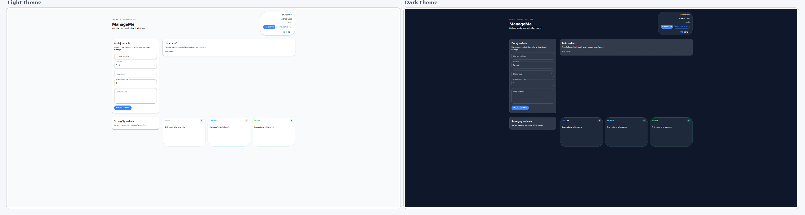
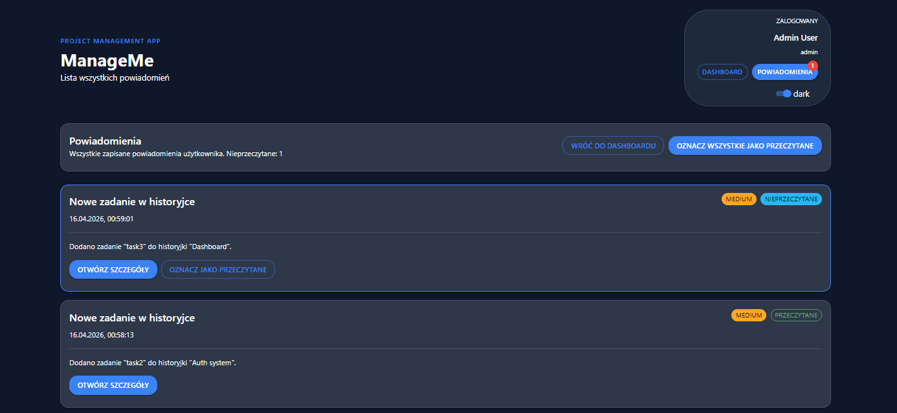

## Changelog

### LAB01 – CRUD projektów
- utworzono aplikację (Vite + React + TypeScript)
- model Project + pełny CRUD
- zapis danych w localStorage (projectStorage)

---

### LAB02 – Historyjki i użytkownik
- mock zalogowanego użytkownika
- aktywny projekt (localStorage)
- model Story + CRUD
- statusy: to do / doing / done
- filtrowanie historyjek

---

### LAB03 – Zadania i logika
- role użytkowników (admin, devops, developer)
- model Task + CRUD
- przypisywanie użytkownika:
  - todo → doing + data startu
- zakończenie zadania:
  - status done + data końca
  - auto zamknięcie historyjki
- tablica kanban (todo / doing / done)

---

### LAB04 – UI i refactor
- podział App.tsx na komponenty
- Material UI
- dark / light mode (localStorage)
- poprawa UX i layoutu
- ulepszony kanban

---

### LAB05 – Powiadomienia
- model Notification + storage
- lista, szczegóły, badge (unread)
- oznaczanie jako przeczytane (manual + auto)
- popup dla medium / high
- powiadomienia dla zdarzeń:
  - task: create, delete, assign, status
  - projekt: create → admin (high)
- walidacja formularza (błędy przy polach)

---

### Visuals

#### Widok główny Light/Dark Mode

#### Powiadomienia

#### Lista zadań + badge

#### Tablica kanban
