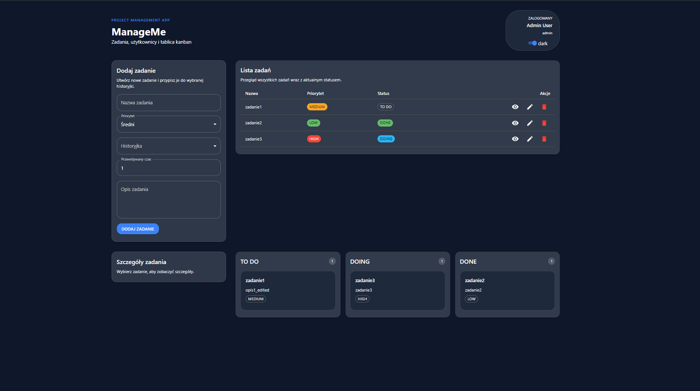
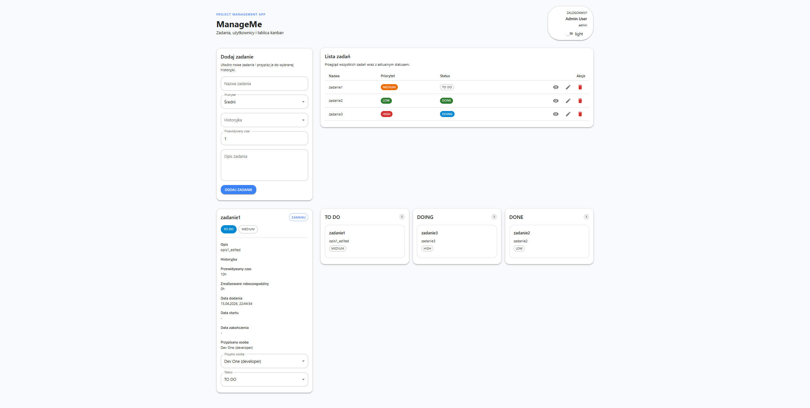

## Changelog

### LAB01
- utworzono projekt (Vite + React + TypeScript)
- zaimplementowano CRUD projektów (id, nazwa, opis)
- zapis danych w localStorage
- wydzielono warstwę komunikacji z API (projectStorage)

---

### LAB02
- dodano mock zalogowanego użytkownika (imię, nazwisko)
- zaimplementowano wybór aktywnego projektu (localStorage)
- dodano CRUD historyjek powiązanych z projektem
- statusy historyjek: todo / doing / done
- priorytety: low / medium / high
- filtrowanie/listowanie historyjek wg statusu

---

### LAB03
- rozbudowano model użytkownika o role (admin, devops, developer)
- dodano listę użytkowników (mock)
- zaimplementowano CRUD zadań
- dodano szczegóły zadania (opis, czas, użytkownik, daty)
- przypisywanie użytkownika:
  - zmiana statusu todo → doing
  - ustawienie daty startu
  - aktualizacja statusu historyjki
- oznaczanie zadania jako done:
  - ustawienie daty zakończenia
  - automatyczne zamknięcie historyjki (jeśli wszystkie zadania done)
- dodano tablicę kanban (todo / doing / done)
- zapis danych przez localStorage API

---

### LAB04
- refactor: podział App.tsx na komponenty:
  - TaskForm, TaskTable, TaskDetails, KanbanBoard
- migracja UI na Material UI
- implementacja dark / light mode:
  - przełącznik + zapis w localStorage
  - obsługa prefers-color-scheme
- poprawa UX:
  - ręczna zmiana statusu (todo / doing / done)
  - przypisywanie użytkownika
  - czytelny wybór historyjki (nazwa + status)
  - możliwość zamykania widoku szczegółów
- poprawa layoutu i estetyki (karty, spacing, responsywność)

---

### Visuals

#### Widok główny /w DarkMode

#### Poprawione/aktualne UI

#### Lista zadań + badge

#### Tablica kanban
