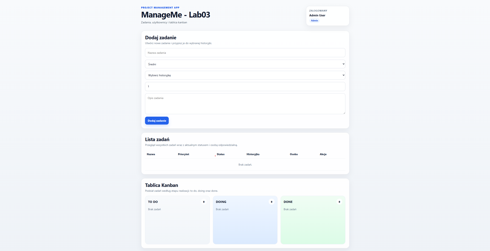
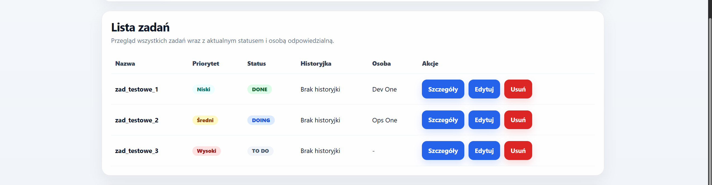
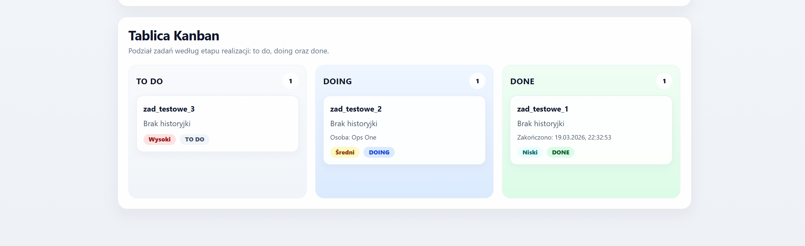

## Changelog

### LAB01
- utworzono projekt w Vite + React + TypeScript
- dodano model Project: id, nazwa, opis
- zaimplementowano CRUD projektów
- dane zapisywane są w localStorage
- dodano dedykowaną klasę ProjectStorageApi do komunikacji z pseudo API

## Lab02
- dodano mock zalogowanego użytkownika
- wyświetlanie imienia i nazwiska użytkownika
- dodano wybór aktywnego projektu
- aktywny projekt zapisywany w localStorage
- dodano CRUD historyjek powiązanych z projektem
- dodano statusy historyjek: todo / doing / done
- dodano priorytety historyjek: low / medium / high
- dodano filtrowanie historyjek po statusie
- poprawiono modele i strukturę localStorage API

### Lab03 – UI / Visual improvements
- wprowadzono spójny layout aplikacji (header + karty)
- dodano sekcję informacyjną z zalogowanym użytkownikiem
- przebudowano formularz dodawania zadania (czytelny układ, spacing)
- ulepszono tabelę zadań:
  - badge dla statusów (todo / doing / done)
  - badge dla priorytetów (low / medium / high)
  - wyróżnienie nazwy zadania
- dodano nowoczesny widok szczegółów zadania:
  - podział na sekcje (grid)
  - czytelne etykiety
- ulepszono tablicę kanban:
  - kolorowe kolumny (todo / doing / done)
  - liczniki zadań w kolumnach
  - karty z badge (status + priorytet)
  - efekt hover na kartach
- poprawiono responsywność (mobile/tablet)
- poprawiono ogólną estetykę (spacing, cienie, kolory, typografia)

---

### Visuals

#### Widok główny

#### Lista zadań + badge

#### Tablica kanban
