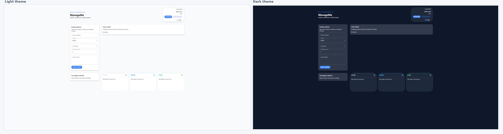
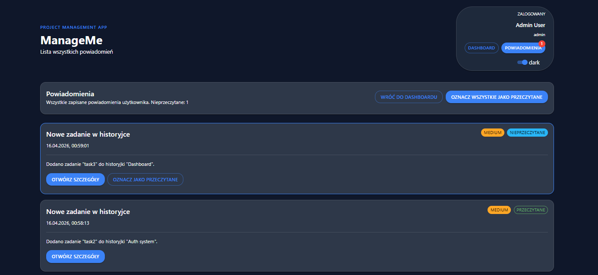
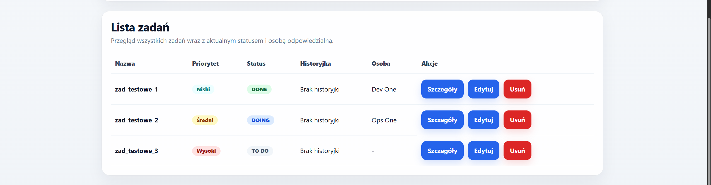
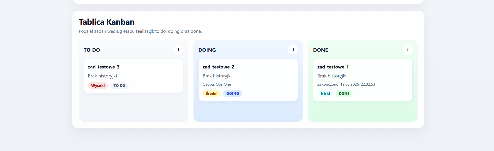
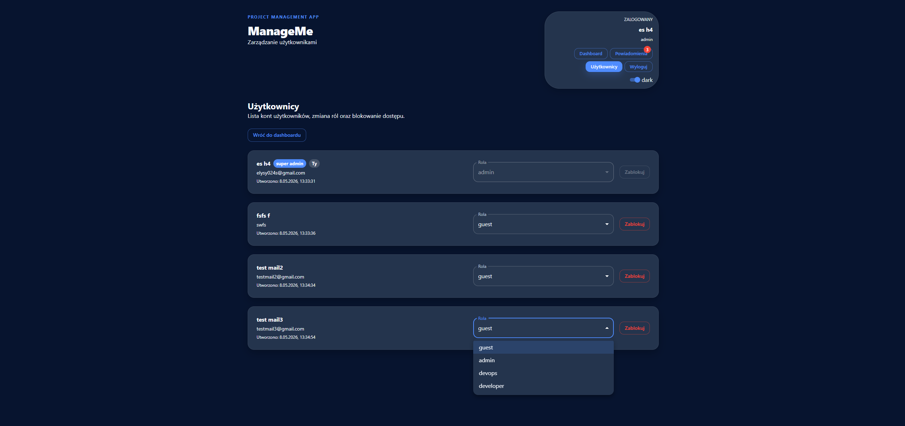

## Changelog

### LAB01 – CRUD projektów
- utworzono aplikację (Vite + React + TypeScript)
- model Project + pełny CRUD
- zapis danych w localStorage (projectStorage)

---

### LAB02 – Historyjki i użytkownik
- mock zalogowanego użytkownika
- aktywny projekt (localStorage)
- model Story + CRUD
- statusy: to do / doing / done
- filtrowanie historyjek

---

### LAB03 – Zadania i logika
- role użytkowników (admin, devops, developer)
- model Task + CRUD
- przypisywanie użytkownika:
  - todo → doing + data startu
- zakończenie zadania:
  - status done + data końca
  - auto zamknięcie historyjki
- tablica kanban (todo / doing / done)

---

### LAB04 – UI i refactor
- podział App.tsx na komponenty
- Material UI
- dark / light mode (localStorage)
- poprawa UX i layoutu
- ulepszony kanban

---

### LAB05 – Powiadomienia
- model Notification + storage
- lista, szczegóły, badge (unread)
- oznaczanie jako przeczytane (manual + auto)
- popup dla medium / high
- powiadomienia dla zdarzeń:
  - task: create, delete, assign, status
  - projekt: create → admin (high)
- walidacja formularza (błędy przy polach)

---

### LAB06
- dodano mock logowania Google OAuth z zapisem użytkowników w localStorage
- dodano rolę `guest`, ekran oczekiwania oraz blokadę dostępu dla zablokowanych kont
- dodano super admina konfigurowanego przez e-mail
- dodano panel admina do zarządzania użytkownikami, rolami i blokadami
- dodano powiadomienia `high` dla adminów po pierwszym logowaniu nowego użytkownika
- odświeżono UI dashboardu i ekranów logowania/autoryzacji

---

### LAB07
- dodano konfigurację wyboru storage provider: `localStorage` / `database`
- zachowano `localStorage` jako fallback dla wcześniejszych laboratoriów
- dodano Firebase Firestore jako bazę NoSQL
- dodano konfigurację Firebase przez `.env` oraz przykładowy plik `.env.example`
- dodano adapter Firestore dla modułu użytkowników
- dodano `userRepository` jako warstwę pośrednią wybierającą źródło danych
- podpięto użytkowników do nowej warstwy storage bez przebudowy całej aplikacji
- umożliwiono zapis i odczyt użytkowników z Firestore w trybie `database`
- pozostawiono projekty, historyjki, zadania i powiadomienia na `localStorage` jako etapową migrację

### Visuals

#### Widok główny Light/Dark Mode

#### Powiadomienia

#### Lista zadań + badge

#### Tablica kanban

#### Admin panel & logowanie

